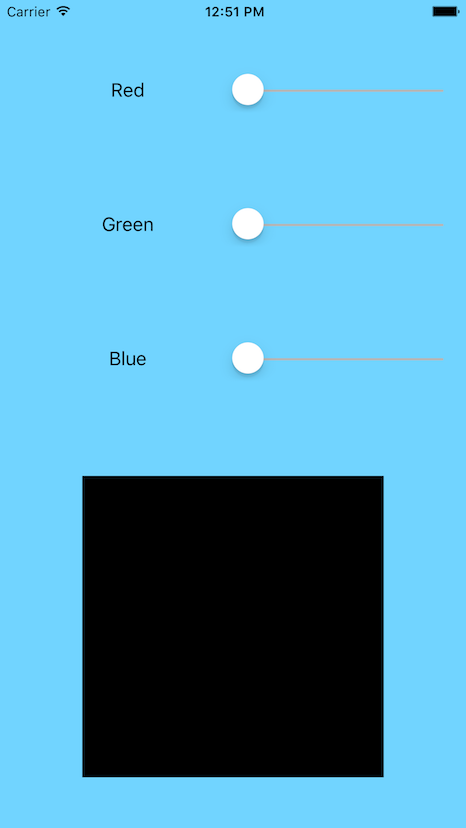
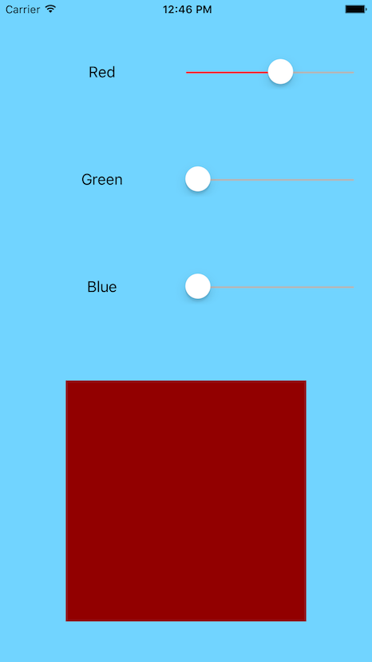
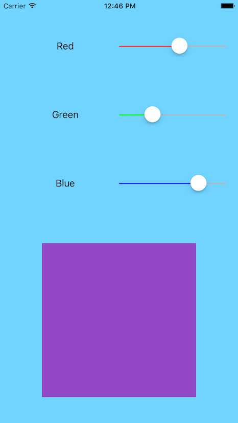
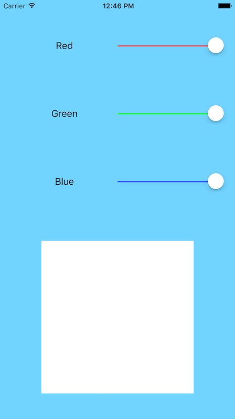

## Challenge App: Color Maker with Sliders

##### UIKit Fundamentals
<https://www.udacity.com/course/uikit-fundamentals--ud788>

#### Summary

In this course, you will build a series of simple apps to become more comfortable with the UIKit framework and master its most widely used components. This framework constitutes the building blocks of the user interface for all iOS apps, and is crucial for any iOS Developer to be intimately familiar with.

#### Syllabus

| Lesson | Topics |
|:----:|--------|
| 1 | Outlets and Actions |
| 2 | View Presentations and Segues |
| 3 | The Delegate Patterns |
| 4 | Tables |
| 5 | Navigation |
| 6 | MemeMe Techniques |

#### Screenshots

